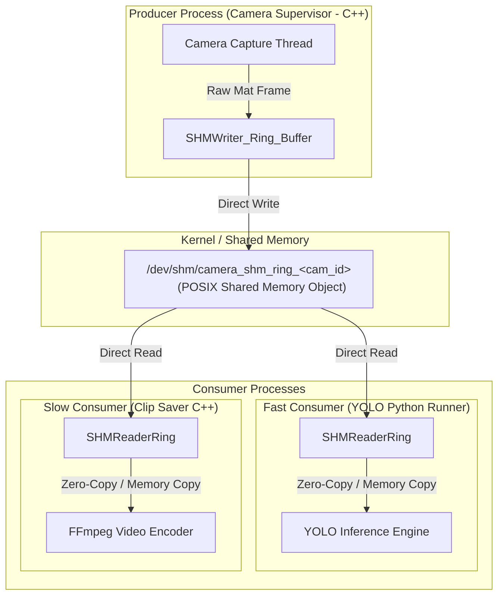

# Shared Memory (SHM) Ring Buffer Architecture & Low-Level Memory Design

This document provides a deep-dive, memory-level architectural specification of the Shared Memory (SHM) Ring Buffer implemented in the codebase. It details how frames are shared between the high-speed C++ Camera Supervisor (writer) and multiple heterogeneous consumers (readers) like Python model runners and C++ clip savers.

---

## 1. System-Level Architecture

In high-performance video analytics pipelines, transferring raw image data (e.g., 1920x1080 BGR frames at 30 FPS, ~6.2 MB per frame) between processes via network sockets (TCP/UDP), local loopback (ZMQ), or pipes introduces significant CPU serialization and copying overhead. 

POSIX Shared Memory (`/dev/shm`) avoids this overhead by allowing separate processes to map the same physical RAM pages into their respective virtual address spaces. 



### The Slow Consumer Problem & Solution
* **The Problem (Single-Buffer)**: If a producer writes directly to a single shared memory slot while a slow reader (like FFmpeg or a deep learning model) is reading it, the reader will read partially overwritten memory. This results in **frame tearing** (visual corruption) or **Bus Errors (`SIGBUS`)** if memory offsets or sizes change dynamically.
* **The Solution (Ring Buffer)**: The shared memory segment is structured as a circular ring of N slots (default 30). The producer writes frames to consecutive slots. Readers read the latest stable slot. Active readers pin slots using atomic reference counts to prevent the writer from overwriting their active memory.

---

## 2. Contiguous Physical Memory Layout

The entire shared memory file is mapped as a single contiguous chunk of physical memory. Compiler padding is disabled using packing directives (`#pragma pack(push, 1)` in C++) to ensure that the memory layout is identical across C++ (writer) and Python (reader, which uses `struct.unpack`).

```
+----------------------------------------------------------------------------------------------------+
|                                      TOTAL SHM SIZE                                                |
+----------------------+-----------------------------+-----------------------------------------------+
|  RingBufferHeader    |         Slot 0              |         Slot 1               ...  Slot N      |
|  (Buffer Metadata &  | +-------------------------+ | +-------------------------+      +----------+ |
|   Write Pointer)     | | SlotMetadata            | | | SlotMetadata            |      | SlotMeta | |
|                      | +-------------------------+ | +-------------------------+      +----------+ |
|                      | | Raw Data (BGR Buffer)   | | | Raw Data (BGR Buffer)   |      | Raw Data | |
|                      | +-------------------------+ | +-------------------------+      +----------+ |
+----------------------+-----------------------------+-----------------------------------------------+
```

### 2.1. Memory Segment Header (`RingBufferHeader`)
The first **32 bytes** of the shared memory space contain buffer-wide configuration parameters, statistics, and the current write cursor.

| Offset (Bytes) | Field Name | Type | Size (Bytes) | Description |
| :--- | :--- | :--- | :--- | :--- |
| **`0`** | `num_slots` | `uint32_t` | 4 | Total slots allocated in the ring buffer (e.g., 30). |
| **`4`** | `frame_width` | `uint32_t` | 4 | Maximum supported frame width. |
| **`8`** | `frame_height` | `uint32_t` | 4 | Maximum supported frame height. |
| **`12`** | `total_frames_written` | `uint64_t` | 8 | Monotonic count of successfully written frames. |
| **`20`** | `total_frames_dropped` | `uint64_t` | 8 | Monotonic count of frames dropped due to busy slots. |
| **`28`** | `write_index` | `std::atomic<uint32_t>` | 4 | Cursor pointing to the latest fully written slot. |

**Python Struct Unpack Format:** `=IIIQQI` (`I` = uint32, `Q` = uint64, total = 32 bytes)

---

### 2.2. Slot Structure (`SlotMetadata` + Raw Frame Data)
Each of the N slots is structured identically. A slot consists of a **44-byte metadata header** followed by a pre-allocated raw frame buffer.

#### Slot Metadata (`SlotMetadata`)
| Offset (Bytes) | Field Name | Type | Size (Bytes) | Description |
| :--- | :--- | :--- | :--- | :--- |
| **`0`** | `frame_seq` | `std::atomic<uint64_t>` | 8 | Sequence counter. **Odd** during write; **Even** when stable. |
| **`8`** | `reader_count` | `std::atomic<uint32_t>` | 4 | Count of processes currently reading from this slot. |
| **`12`** | `width` | `uint32_t` | 4 | Actual width of the frame in this slot. |
| **`16`** | `height` | `uint32_t` | 4 | Actual height of the frame in this slot. |
| **`20`** | `frame_number` | `uint64_t` | 8 | Monotonic frame sequence ID. |
| **`28`** | `timestamp_us` | `uint64_t` | 8 | Microsecond Unix epoch timestamp. |
| **`36`** | `data_size` | `uint32_t` | 4 | Size of raw frame data in bytes (typically `width * height * 3`). |
| **`40`** | `_padding` | `uint32_t` | 4 | 4-byte padding to ensure 8-byte boundary alignment. |

**Python Struct Unpack Format:** `=QIIIQQII` (`Q` = uint64, `I` = uint32, total = 44 bytes)

#### Raw Frame Data
Directly follows `SlotMetadata` inside each slot:
* **Size**: `max_frame_width * max_frame_height * 3` bytes (for 3-channel BGR/RGB images).
* **Alignment**: Aligned immediately after the 44-byte metadata header.

---

### 2.3. Pointer Arithmetic & Memory Addressing

To locate any slot `i` (where `0 <= i < num_slots`), the writer and reader calculate pointers using base-offset arithmetic.

```
slot_data_size   = frame_width * frame_height * 3
slot_total_size  = sizeof(SlotMetadata) + slot_data_size
```

#### C++ Address Calculation
```cpp
// Base pointer mapped via mmap()
uint8_t* base = reinterpret_cast<uint8_t*>(shm_ptr);

// Offset for slot i
size_t slot_offset = sizeof(RingBufferHeader) + (i * slot_total_size);

// Pointers to metadata and data
SlotMetadata* meta = reinterpret_cast<SlotMetadata*>(base + slot_offset);
uint8_t* raw_data  = base + slot_offset + sizeof(SlotMetadata);
```

#### Python Address Calculation
```python
# Mmap object initialized from /dev/shm/camera_shm_ring_<id>
# Offset calculations
slot_offset = self.HEADER_SIZE + (slot_idx * self.slot_total_size)
meta_offset = slot_offset
data_offset = slot_offset + self.SLOT_META_SIZE
```

---

## 3. Lock-Free Synchronization & Flow Control

The ring buffer is designed to operate without POSIX Mutexes or Semaphores in the hot path. Instead, it relies on atomic memory operations and sequence counters to coordinate access. This eliminates thread scheduling overhead and context switching latencies.

### 3.1. Writer Protocol (Frame Producer)

When the Camera Supervisor captures a new frame, it executes the following logic to safely commit the frame to the next available slot:

```
                  +-----------------------------------+
                  |        Capture New Frame          |
                  +-----------------------------------+
                                    |
                                    v
                  +-----------------------------------+
                  |  Calculate next slot index:       |
                  |  next_idx = (write_index + 1) % N |
                  +-----------------------------------+
                                    |
                                    v
                  +-----------------------------------+
                  | Load reader_count for next_idx    |
                  +-----------------------------------+
                                    |
                                    +<----------------------+
                                    |                       |
                                    v                       | (Wait up to 1ms)
                          [reader_count > 0?]               |
                             /          \                   |
                           Yes           No                 |
                           /              \                 |
            [Wait attempts >= 10?]         +----------------+
                 /          \
               Yes           No ---> Sleep 100 microseconds
               /
              v
     +--------------------------------+
     |   Drop Frame (Buffer Full)     |
     |   total_frames_dropped++       |
     +--------------------------------+
                      |
                      v
     +--------------------------------+
     |             Exit               |
     +--------------------------------+
                      |
       +--------------+ (If reader_count == 0)
       |
       v
+-------------------------------------------------------+
| 1. Load current frame_seq                             |
| 2. Store frame_seq + 1 (Odd: signals write in progress|
|    to all readers)                                    |
| 3. Copy raw pixel data: memcpy(slot_data, frame)      |
| 4. Write metadata: width, height, timestamp, frame_no |
| 5. Store frame_seq + 2 (Even: signals write complete) |
| 6. Update global write_index = next_idx               |
| 7. Increment total_frames_written                     |
+-------------------------------------------------------+
```

### 3.2. Reader Protocol (Frame Consumers)

Consumers (YOLO detector, Clip Saver) read the latest written frame by retrieving the global `write_index` and executing a double-sequence validation check.

```
                      +-----------------------------------+
                      |      Read Latest Frame            |
                      +-----------------------------------+
                                        |
                                        v
                      +-----------------------------------+
                      | 1. Read global write_index        |
                      | 2. Point to write_idx Slot        |
                      +-----------------------------------+
                                        |
                                        v
                      +-----------------------------------+
                      | Read frame_seq (seq_before)       |
                      +-----------------------------------+
                                        |
                                        v
                            [seq_before % 2 != 0?]
                             /                  \
                           Yes                  No (Slot stable)
                           /                      \
             +---------------------+               v
             | Write In Progress:  |     +------------------------------------+
             | Abort / Skip Read   |     | Pin Slot: Increment reader_count   |
             |                     |     | (atomic fetch_add)                 |
             +---------------------+     +------------------------------------+
                                                           |
                                                           v
                                         +------------------------------------+
                                         | Read frame_seq again (seq_check)   |
                                         +------------------------------------+
                                                           |
                                                           v
                                               [seq_check != seq_before?]
                                                /                      \
                                              Yes (Writer overtook)    No (Lock acquired)
                                              /                          \
                                 +---------------------+                  v
                                 | Unpin & Abort:      |        +-------------------+
                                 | Decrement reader    |        | Copy frame bytes  |
                                 | count               |        | to local memory   |
                                 +---------------------+        +-------------------+
                                                                          |
                                                                          v
                                                                +-------------------+
                                                                | Read frame_seq    |
                                                                | (seq_after)       |
                                                                +-------------------+
                                                                          |
                                                                          v
                                                                +-------------------+
                                                                | Unpin Slot:       |
                                                                | Decrement reader  |
                                                                | count             |
                                                                +-------------------+
                                                                          |
                                                                          v
                                                               [seq_after != seq_before?]
                                                                /                      \
                                                              Yes                      No
                                                              /                          \
                                                +-------------------------+      +-------------------+
                                                | Corruption Detected:     |      | Frame read        |
                                                | Discard Copied Buffer   |      | successfully!     |
                                                +-------------------------+      +-------------------+
```

---

## 4. Why This Architecture Prevents Core Dumps and Bus Errors

In standard single-buffer IPC, readers are vulnerable to two catastrophic failure modes:
1. **Frame Tearing (Data Corruption)**: The writer overwrites part of the frame while the reader is actively copying it. The reader gets a hybrid frame containing top half of frame `N` and bottom half of frame `N-1`.
2. **Segmentation Faults / Bus Errors (`SIGBUS`)**: If a reader is accessing shared memory and the size of the mapping changes or the writer deletes/re-truncates the file, the page tables mapped into the reader's virtual address space point to invalid physical blocks.

This architecture mitigates both issues through:
* **Pre-allocated Contiguous Regions**: `ftruncate` is only called once at initialization. The shared memory size is static and never resized dynamically.
* **Reader Count Pinning**: The C++ writer is cooperative. It checks `reader_count` and will wait up to 1 millisecond. If a slow consumer is holding the slot, the writer avoids touch-writing to that memory page, preserving the reader's memory block stability.
* **Double Sequence Checking**: If the reader's execution is preempted by the OS scheduler mid-copy, the writer may decide to drop frame-waiting and eventually loop back and overwrite the pinned slot. When the reader resumes and completes its copy, the final `seq_after != seq_before` check will evaluate to `true`. The reader identifies that the memory was updated during its sleep and safely discards the frame instead of feeding corrupt data to inference or encoding engines.

---

## 5. Memory Footprint Reference Table

Memory requirements scale linearly with the maximum resolution and the number of slots in the ring buffer. The formula to determine the exact virtual memory map size is:

$$\text{Total size} = \text{sizeof(RingBufferHeader)} + N \times (\text{sizeof(SlotMetadata)} + (\text{Max Width} \times \text{Max Height} \times 3))$$

Using $32 \text{ bytes (Header)} + N \times (44 \text{ bytes (Metadata)} + \text{Frame Bytes})$:

| Resolution | Max Frame Size (BGR) | Slots ($N$) | Overhead | Total SHM Size |
| :--- | :--- | :--- | :--- | :--- |
| **HD (1280 x 720)** | 2.76 MB | 10 | 472 B | **27.64 MB** |
| **HD (1280 x 720)** | 2.76 MB | 30 | 1,352 B | **82.94 MB** |
| **Full HD (1920 x 1080)** | 6.22 MB | 15 | 692 B | **93.31 MB** |
| **Full HD (1920 x 1080)** | 6.22 MB | 30 | 1,352 B | **186.62 MB** |
| **Full HD (1920 x 1080)** | 6.22 MB | 60 | 2,672 B | **373.25 MB** |
| **4K UHD (3840 x 2160)** | 24.88 MB | 30 | 1,352 B | **746.49 MB** |